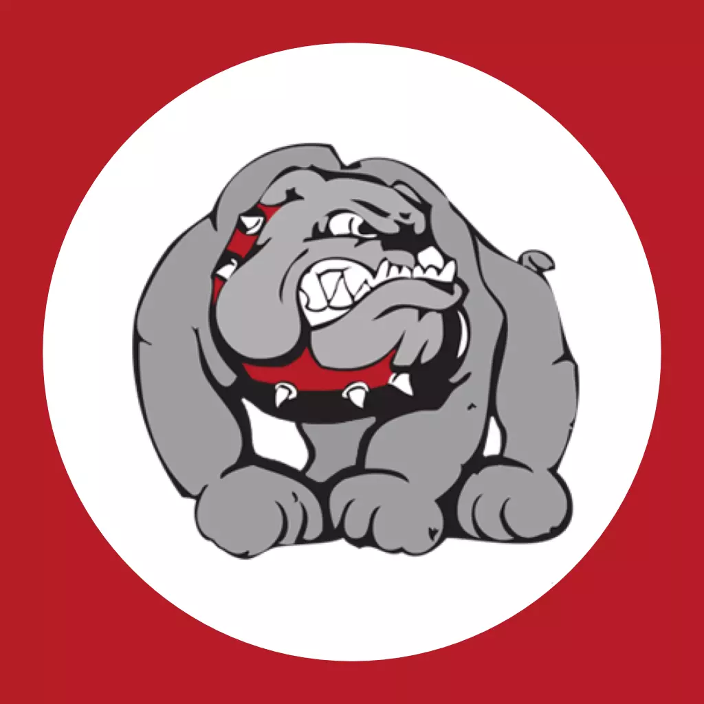
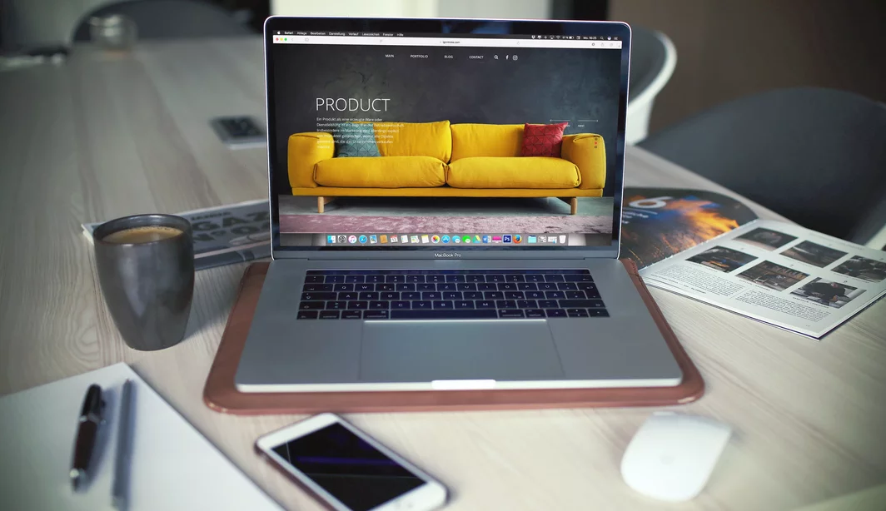

<!-- Main -->

<!-- One -->
<section id="one">
	

		<header class="major">
			<h2>What I do</h2>
		</header>
		
I make Discord bots with <a href="https://discord.js.org">discord.js</a>. I also make websites like these.

	

</section>

<!-- Two -->
<section id="two" class="spotlights">
		<section>
			
			

				

					<header class="major">
						<h3>SJHS Bot</h3>
					</header>
					
<a href="https://sjhsbot.js.org/">SJHS Bot</a> is a <a href="https://discordapp.com/">Discord</a> bot for helping students at
						a <a href="http://sjusd.org/san-jose-high">SJHS</a> with everyday tasks, like remembering your homework and when next class
						starts.

					<ul class="actions">
						<li><a href="https://sjhsbot.js.org/" class="button">Learn more</a></li>
					</ul>
				

			

		</section>
		<section>
			
			

				

					<header class="major">
						<h3>Kelly Snider Consulting Website</h3>
					</header>
					
An interactive and responsive portfolio for Kelly Snider Consulting.

					<ul class="actions">
						<li><a href="pizzafox.github.io/kscsite" class="button">See It</a></li>
					</ul>
				

			

		</section>
		<section>
			
			

				

					<header class="major">
						<h3>Web Design</h3>
					</header>
					
Want a website made? Need design advice? I have lots of experience in graphic design, user interface, hosting, and web
						design. Get in touch if you want to hire me or if you want any advice.

					<ul class="actions">
						<li><a href="webdesign" class="button">Learn More</a></li>
					</ul>
				

			

		</section>
	</section>

<!-- Three -->
<section id="three">
	

		<header class="major">
			<h2>Other projects</h2>
		</header>
		
The above three projects are my biggest and most recent projects. Here are some of the runner-ups.

		<ul class="actions">
			<li><a href="generic.html" class="button next">Poll Bot</a></li>
		</ul>
	

</section>
</section>

